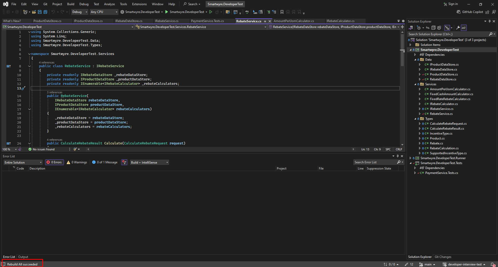

# `SOLID` Principles Implementation

The system design adheres to the SOLID principles as follows:

## 1. `S`ingle Responsibility Principle (SRP)

- <b>RebateService</b>: Focuses solely on the calculation of rebates.

- <b>Rebate Calculators</b>: Each calculator class (e.g., <b>FixedCashAmountRebateCalculator</b>) is responsible for handling calculations specific to one type of incentive.

- <b>DataStores</b>: Separate classes (<b>RebateDataStore</b>, <b>ProductDataStore</b>) handle data access responsibilities.

## 2. `O`pen/Closed Principle (OCP)

- The system is designed to be open for extension but closed for modification. New incentive types can be added by:

- - Implementing a new <b>IRebateCalculator</b> without modifying existing code.

- - Updating the <b>IncentiveType</b> enum and adding new calculator classes.

## 3. `L`iskov Substitution Principle (LSP)

- All implementations of <b>IRebateCalculator</b> can be used interchangeably in the <b>RebateService</b> class without affecting its correctness. Each calculator adheres to the contract specified by the <b>IRebateCalculator</b> interface.

## 4. `I`nterface Segregation Principle (ISP)

- <b>IRebateCalculator</b>: Provides specific methods (<b>CanCalculate</b>, <b>Calculate</b>) relevant to rebate calculations, avoiding a monolithic interface. Implementations are not forced to depend on methods they do not use.

## 5. `D`ependency Inversion Principle (DIP)

- <b>RebateService</b> depends on abstractions (<b>IRebateDataStore</b>, <b>IProductDataStore</b>, <b>IRebateCalculator</b>), not concrete implementations. This allows flexibility in changing data stores or adding new calculators.

<br><br><br><br>

# Adding a `New` Incentive Type

This guide outlines the process for adding a new `IncentiveType` to the rebate calculation system. Follow these instructions to integrate the new type smoothly into the project.

## 1. Update the `IncentiveType` Enum

To introduce a new incentive type, first update the `IncentiveType` enum to include the new type.

**File: `Smartwyre.DeveloperTest.Types/IncentiveType.cs`**

```csharp
namespace Smartwyre.DeveloperTest.Types
{
    public enum IncentiveType
    {
        FixedRateRebate,
        AmountPerUom,
        FixedCashAmount,
        NewIncentiveType // Add the new incentive type here
    }
}
```

## 2. Create a New Rebate Calculator

Implement a new class that adheres to the `IRebateCalculator` interface. This class will handle the calculation logic for the new incentive type.

**File: `Smartwyre.DeveloperTest.Services/NewIncentiveTypeRebateCalculator.cs`**

```csharp
using Smartwyre.DeveloperTest.Types;

namespace Smartwyre.DeveloperTest.Services
{
    public class NewIncentiveTypeRebateCalculator : IRebateCalculator
    {
        public bool CanCalculate(IncentiveType incentiveType)
        {
            return incentiveType == IncentiveType.NewIncentiveType;
        }

        public decimal Calculate(Rebate rebate, Product product, CalculateRebateRequest request)
        {
            // Implement the calculation logic for the new incentive type here
            // Example logic:
            if (rebate.Amount == 0 || request.Volume == 0)
            {
                return 0;
            }
            return rebate.Amount * request.Volume; // Replace with actual logic
        }
    }
}
```

## 3. You don't need to modify `RebateService.cs`

<br><br><br><br>

# All Tests are successful

## 1. The project is built successfully by clicking `F5` or `F6`


## 2. The project is tested successfully by clicking `ctrl + R + A`
